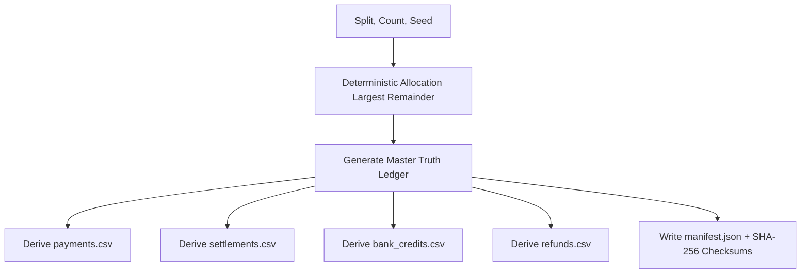

# ReconcileX Synthetic Benchmark Methodology

## 1. Purpose

The ReconcileX Synthetic Benchmark framework provides a rigorous, automated, and byte-for-byte reproducible suite for testing and evaluating deterministic financial reconciliation engines at scale.

Rather than relying solely on handcrafted test cases, the benchmark tests edge-case handling, rule precedence, idempotency, data quarantine, and timing/financial equations across hundreds of randomized, rule-constrained financial scenarios.

---

## 2. Dataset Generation Model

The benchmark follows an evaluation-first generation pipeline:

### Strict Label Decoupling
- The reconciliation engines receive **only** the derived input files (`payments.csv`, `settlements.csv`, `bank_credits.csv`, `refunds.csv`).
- Truth labels (`truth_group_id`, `expected_system_result`, `scenario`, `reason`) exist **only** in `evaluation/truth_ledger.csv`.
- The matching engines have zero access to truth metadata, preventing data leakage or benchmark-overfitting.

---

## 3. Supported Scenarios

| Scenario Type | Expected Outcome | Description |
|---|---|---|
| `EXACT_MATCH` | `AUTO_MATCH` | Valid payment, settlement, and bank credit with matching amounts and dates. |
| `VALID_REFUND` | `AUTO_MATCH` | Partial refund processed prior to settlement; net amount correctly reflects deduction. |
| `SETTLEMENT_DELAY` | `EXCEPTION: SETTLEMENT_DELAY` | Settlement occurs 8–14 days after payment capture (> 7 days policy limit). |
| `AMOUNT_VARIANCE` | `EXCEPTION: AMOUNT_VARIANCE` | Bank credit amount differs from expected net calculation by > ₹0.01. |
| `MISSING_REFERENCE` | `EXCEPTION: MISSING_REFERENCE` | Bank credit narration omits the settlement ID (no fuzzy guessing). |
| `MISSING_PAYMENT_ID` | `EXCEPTION: MISSING_PAYMENT_ID` | Settlement record contains a blank `payment_id`. |
| `STATUS_CONFLICT` | `EXCEPTION: STATUS_CONFLICT` | Payment has status `failed` but settlement/bank records exist. |
| `INVALID_BANK_AMOUNT` | `EXCEPTION: INVALID_ROW` | Bank credit amount is `"NOT_A_NUMBER"` and quarantined gracefully. |
| `DUPLICATE_PAYMENT_EVENT` | `AUTO_MATCH + DUPLICATE_AUDIT` | Duplicate ingestion event ignored and audited; exactly 1 match produced. |

---

## 4. Reproducibility & Integrity

1. **Deterministic Random State**: An isolated `random.Random(seed)` instance is used throughout generation; no global random state is touched.
2. **Deterministic Scenario Allocation**: Uses the *Largest Remainder Method* (Hamilton Method) to distribute exact scenario counts across defined weights.
3. **Manifest & SHA-256 Checksums**: Every benchmark directory includes a `manifest.json` recording the split, seed, scenario count, scenario distribution, and SHA-256 cryptographic hashes for all generated files.
4. **Standard Splits**:
   - `dev` (`count=250`, `seed=20260901`): Standard distribution for local validation.
   - `heldout` (`count=500`, `seed=20260902`): Large evaluation split for regression verification.
   - `chaos` (`count=100`, `seed=20260903`): High-exception split heavily weighted towards errors and edge cases.

---

## 5. Evaluation Metrics

- **Exact Outcome Agreement**: Proportion of scenarios where the engine's normalized outcome matches the truth ledger expected string.
- **Unsafe Auto-Match**: An `AUTO_MATCH` produced on a scenario where the ground truth is an `EXCEPTION`. In financial controllership, unsafe auto-matches represent potential financial losses or silent reconciliations of corrupt/delayed transactions.
- **Auto-Match Precision**:
  $$\text{Auto-Match Precision} = \frac{\text{Correct Auto-Matches}}{\text{Total Actual Auto-Matches}}$$
- **Auto-Match Recall**:
  $$\text{Auto-Match Recall} = \frac{\text{Correct Auto-Matches}}{\text{Total Truth Auto-Match Scenarios}}$$
- **Exception Precision & Recall**: Measured across all exception categories to verify root-cause classification accuracy.
- **Throughput**: Measured in scenarios/second and input-rows/second using standard `time.perf_counter()`.

---

## 6. Known Limitations & Disclaimer

> [!WARNING]
> **Disclaimer**: Benchmark results reflect agreement against a seeded synthetic dataset generated under the documented ReconcileX V1 rules. They are not evidence of production merchant data accuracy, real payment gateway API behavior, complex fee contracts, or multi-split settlements.
